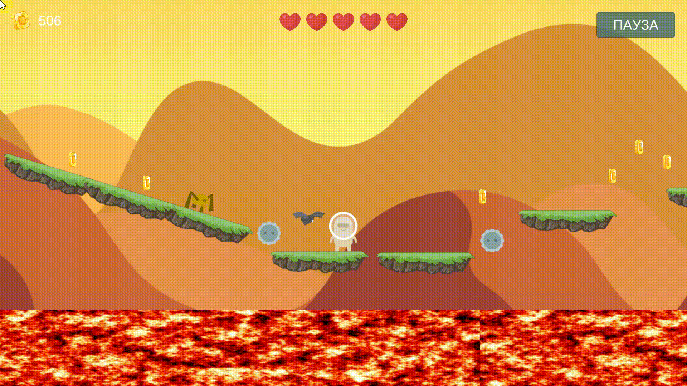
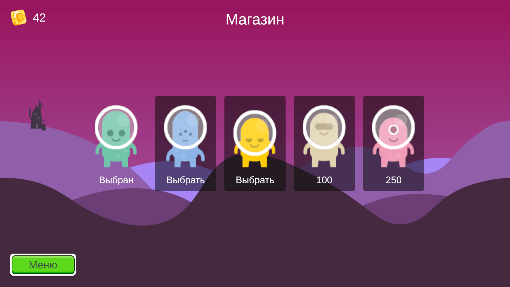
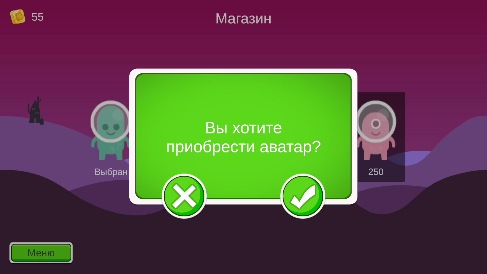
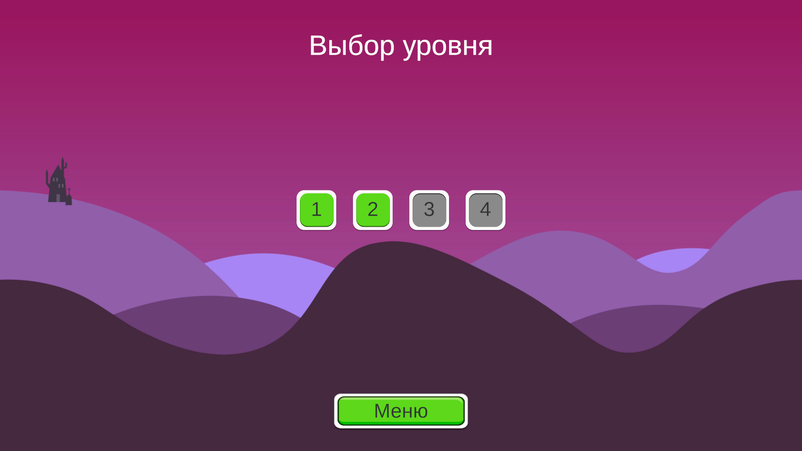
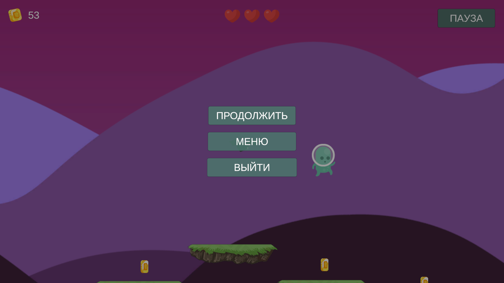

# AlienPlatformer
Платформер про милого пришельца с далёкой планеты 👽

Помоги ему пройти все уровни и открой всех его друзей!

## О проекте
Проект представляет собой игру на движке [Unity](https://unity.com/). Проект создавался в учебных целях, чтобы изучить возможности движка.

Целью было создать полноценную игру на [Unity](https://unity.com/), детально уделив внимание каждой мелочи.

## В игре вас ждут

* четыре уровня с разными локациями;
* пять персонажей на выбор;
* компаньон, следующий за персонажем;
* возможность поставить игру на паузу;
* возможность собирать монетки и жизни;
* враги разного типа;
* сохранение прогресса;
* а также: главное меню, меню для выбора уровней, магазин, окно настроек с возможностью сброса прогресса

## Демонстрация

### Локации в игре

Попав на новую планету пришелец познакомится с экосистемой планеты в разных её частях. В игре присутствует четыре уровня, каждый в своей незабываемой локации

#### Вечерняя долина

#### Таинственный лес

#### Заснеженные горы

#### Раскалённая пустыня

### Сцены в игре

#### Магазин

Всплывающее окошечко, чтобы уж точно не купить ничего лишнего

#### Выбор уровня

#### Пауза

## Как скачать и запустить проект

### Вариант 1

Скачать архив с игрой со страницы [релизов](https://github.com/pashabezk/AlienPlatformer/releases).

### Вариант 2

Запустить исходный проект с помощью [Unity](https://unity.com/). Для этого выполните следующие шаги:

1. Клонировать репозиторий с помощью команды

`git clone https://github.com/pashabezk/AlienPlatformer`

2. Если у Вас нет [Unity Hub](https://unity.com/ru/download), то скачать его и запустить

3. В Unity Hub на вкладке Projects выбрать `Open` → `Add project from disk`, указать путь к папке

`<место, где хранится проект>/AlienPlatformer/AlienPlatformer`

4. Запустить проект и подождать, пока Unity докачает нужные библиотеки

5. В папке `Assets/Scenes` выбрать любую сцену and enjoy coding :)

## Материалы
Ниже представлены материалы, использованные при разработке игры.

#### Unity Assets

* Кнопки и UI: [2D Casual UI HD](https://assetstore.unity.com/packages/2d/gui/icons/2d-casual-ui-hd-82080)
* Задний фон: [Free 2D Cartoon Parallax Background](https://assetstore.unity.com/packages/2d/environments/free-2d-cartoon-parallax-background-205812)
* Монетки: [Free Platform Game Assets](https://assetstore.unity.com/packages/2d/environments/free-platform-game-assets-85838)

#### Kenney
* Персонаж и враги: [Platformer Art Extended Enemies](https://www.kenney.nl/assets/platformer-art-extended-enemies)

#### Музыка и звуки
* Фоновая музыка (Alisha_Sutudo - Titanium): [pixabay](https://pixabay.com/music/future-bass-titanium-170190/)
* Звуки:
    * Шестерёнка: [mixkit](https://assets.mixkit.co/active_storage/sfx/2642/2642.wav)
    * Паук: [envato](https://elements.envato.com/ru/spider-bite-J75JDRF)
    * Пиранья: [envato](https://elements.envato.com/ru/video-game-bite-274BNQC)
